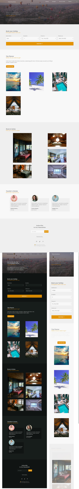

## DESCRIPTION:
- A mobile-first responsive website for A Travel Agency.
- [Youtube Video of the App](https://youtu.be/epqvEcEi7es)

## OUTCOME:
- A Mobile first responsive website, with light/dark mode.
- link to the App's video on youtube: https://youtu.be/epqvEcEi7es

## TECH STACKS:
- HTML + CSS + JS.
- Library: 
    - Icons: BoxIcons.com
    - Scroll reveal: https://unpkg.com/scrollreveal
## PROGRESS:
- Done: 100%.
- Mobile responsive? YES.

## PROBLEMS:
01. 1 code aren't working (I can't find the reason (yet)):
    - "The Active Link" refer to "App.js" -> "function scrollActive()".
    
## View other projects:
- [My Blog](https://hashnode.com/@marizoo)
- [My Pinterest](https://pin.it/16vGwjy)
- [My Youtube Channel](https://www.youtube.com/channel/UCfkbnM9WvHD3mjecBiGHCBQ/playlists)

## IMAGE:

